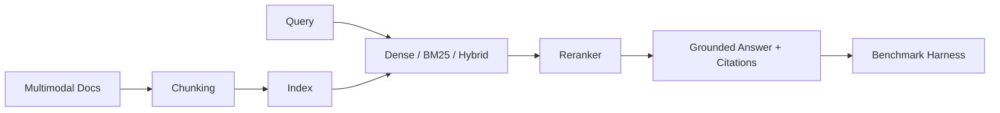

# Mosaic

[](https://github.com/jahidbappi/mosaic-rag/actions)
[](https://mosaic-rag.vercel.app)

**Multimodal retrieval engine with a reproducible evaluation harness.**

**Live website:** https://mosaic-rag.vercel.app · **Docs:** https://mosaic-rag.vercel.app/docs · **Benchmarks:** https://mosaic-rag.vercel.app/benchmarks

Mosaic assembles text and image chunks into grounded, cited answers — like tiles in a mosaic forming one coherent picture. It ships pluggable embeddings, hybrid retrieval, rerankers, chunking strategies, and honest benchmark ablations.

## Why Mosaic

Most RAG repos demo a happy path. Mosaic is built like internal FAANG tooling:

- Typed, tested Python library
- Pluggable components (swap embedders/retrievers/rerankers/chunkers)
- Reproducible benchmark harness with ablation leaderboard
- Metrics: Recall@k, MRR, faithfulness, correctness, latency, cost

## Architecture



## Quick Start

```bash
cd mosaic
python3 -m venv .venv
source .venv/bin/activate
pip install -e ".[dev]"
pytest
mosaic-benchmark --quick
mosaic-benchmark --output benchmarks/results
```

## Library API

```python
from mosaic import MosaicPipeline
from mosaic.eval.datasets import load_sample_corpus
from mosaic.types import Query

pipeline = MosaicPipeline()
pipeline.index(load_sample_corpus())

result = pipeline.retrieve(Query(text="How does hybrid retrieval work?", top_k=5))
answer = pipeline.answer(Query(text="How does hybrid retrieval work?", top_k=5))
print(answer.text)
print(answer.citations)
```

## Components

| Layer | Implementations |
|-------|-----------------|
| Embeddings | `mock-text`, `mock-multimodal`, `sentence-transformers`, `clip` |
| Retrieval | `dense`, `bm25`, `hybrid` |
| Rerankers | `score-fusion`, `cross-encoder` |
| Chunking | `fixed-size`, `semantic` |

## Benchmark

Run full ablations:

```bash
mosaic-benchmark --output benchmarks/results
```

Outputs:

- `benchmarks/results/ablation_results.json`
- `benchmarks/results/leaderboard.json`

See [docs/benchmarks.md](docs/benchmarks.md) for methodology and findings.

## Development

```bash
ruff check src tests
mypy src
pytest --cov=mosaic
mkdocs serve
```

## License

MIT
